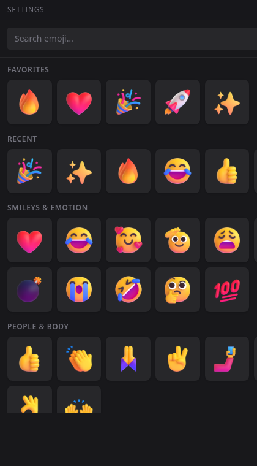

# Gobcam

> Animated emoji reactions for any Linux video call, served as a virtual webcam.

<p align="center">
  
</p>

## Why

Most call apps draw reactions inside their own client. On Linux those
features are often late, broken, or missing, and the overlay only exists
inside that one app.

Gobcam draws the reaction into the camera feed instead. The meeting app
doesn't need an integration or plugin; it just sees a webcam, and the
overlay shows up wherever that camera is used.

## What it is

Two processes start together:

- A GStreamer **pipeline daemon** that reads your real camera, blends
  emoji reactions on top, and writes the result to a `v4l2loopback`
  device (`/dev/video10`).
- A **floating Tauri panel** for picking emoji and triggering them.
  Global hotkeys, a system tray, full search across the ~1500 emoji
  in Microsoft's [Fluent UI Emoji][fluent] set.

For normal use, start the UI (`Gobcam`, `gobcam-ui`, or the AppImage).
It will attach to an existing pipeline daemon if one is already running;
otherwise it starts `gobcam-pipeline` itself.

Reactions stack instead of replacing each other, so repeated clicks
create a cascade across the frame. Static 3D Fluent images and animated
APNGs both work; they are fetched on first use and cached locally.

<p align="center">
  
</p>

[fluent]: https://github.com/microsoft/fluentui-emoji

## Install

Pick the path that matches your distro. Each package installs the same
daemon and UI.

### Arch / Manjaro / EndeavourOS — local package build

```sh
just aur-install-local   # builds and installs the local gobcam-bin package
sudo gobcam-setup        # one-time: enables passwordless loopback resets
```

The AUR publish is still upcoming. The local recipe uses the same
`PKGBUILD.in` that will be published later, but it installs from the
`.deb` built in your checkout instead of downloading from a public
release URL.

### Debian / Ubuntu / Mint / Pop!\_OS — `.deb`

Grab `Gobcam_*.deb` from the [latest release][releases] and install it:

```sh
sudo apt install ./Gobcam_*.deb
```

The postinst loads `v4l2loopback`, drops the `/etc/modules-load.d`
+ `/etc/modprobe.d` snippets so it auto-loads at boot, and writes
a narrow `/etc/sudoers.d/gobcam` rule for the panel's auto-reset
path. **Gobcam** appears in your application launcher.

### Everything else — AppImage

Grab `Gobcam_*.AppImage` from the [latest release][releases]:

```sh
chmod +x Gobcam_*.AppImage
./Gobcam_*.AppImage
```

The first launch shows a **Set up Gobcam** prompt that runs the
bundled `gobcam-setup` via `pkexec` (graphical password prompt).
After that, the loopback module loads on every boot and the app
opens straight to the panel.

To make the AppImage appear in your application launcher, drop it
under `~/Applications/` and use [AppImageLauncher][ail] or
[`appimaged`][appimaged].

[releases]: https://github.com/titarch/gobcam/releases
[ail]: https://github.com/TheAssassin/AppImageLauncher
[appimaged]: https://github.com/probonopd/go-appimage

## First run

1. Launch **Gobcam** from your application launcher (or run the
   installed `gobcam-ui` / the AppImage directly). Starting the UI is
   enough; it starts the pipeline daemon if it is not already running.
2. The first time the panel opens, it picks `/dev/video0` as the
   input camera. If that's wrong, open the settings drawer and pick
   another device.
3. Open your video call client (Teams, Meet, Zoom, Discord, a
   browser at <https://webcamtests.com/>) and select **Gobcam** as
   the camera.
4. Click any emoji in the panel. It plays over your feed for a few
   seconds.

## Using Gobcam

**Search.** Start typing — the catalog filters live.

**Hotkeys.** Three slots are bindable from the settings drawer:
hold the chosen modifier + key from anywhere on the desktop and the
mapped emoji fires. The default modifier is `Super`.

**Tray.** Closing the panel hides it; only the tray's *Quit* (or
killing the supervising UI process) ends the daemon. Right-click the
tray icon to bring the panel back, toggle reactions on or off, or
quit.

**Cascade.** Spam-clicking the same emoji stacks reactions across
the frame instead of replacing the previous one. Up to 48
concurrent reactions; the 49th waits for a slot.

**Always-on overlay.** For debugging or automation, you can run the
daemon directly:

```sh
gobcam-pipeline --overlay fire     # pinned, no animation
```

**Programmatic triggers.** The daemon listens on a Unix socket
when launched with `--socket`:

```sh
SOCK="$XDG_RUNTIME_DIR/gobcam.sock"
gobcam-pipeline --socket "$SOCK" &
echo '{"type":"trigger","emoji_id":"fire"}' | ncat -U "$SOCK"
```

Wire types: see [`crates/protocol/`](crates/protocol/).

## Build from source

Quickstart for contributors lives in [`AGENTS.md`](AGENTS.md). Short
version:

```sh
./scripts/setup-host.sh   # GStreamer plugins + v4l2loopback-dkms
just install-loopback     # one-time, sets up /dev/video10
just app                  # build everything, launch the panel
```

Supported toolchain is pinned in `rust-toolchain.toml`. Run
`just check` before committing; `just ci` adds the Docker image build
for a fuller local pass. Pull requests run the same gate in Actions.

## Status

- **What works:** webcam → optional always-on overlay → up to 48
  concurrent triggered reactions with fade/drift animation, hotkeys,
  tray, lazy-fetched animated APNGs, v4l2loopback output.
- **Roadmap:** see [`docs/roadmap.md`](docs/roadmap.md).
- **Changelog:** see [`docs/CHANGELOG.md`](docs/CHANGELOG.md).
- **Architecture:** see [`docs/architecture.md`](docs/architecture.md).
- **Troubleshooting:** see [`docs/troubleshooting.md`](docs/troubleshooting.md).

## License & credits

Gobcam is MIT-licensed; see [`LICENSE`](LICENSE).

- Emoji artwork: [Microsoft Fluent UI Emoji][fluent] (MIT).
- Demo footage: [*Big Buck Bunny*][bbb] © Blender Foundation,
  CC-BY 3.0. Used here as a stand-in for a real webcam feed in
  the screenshots and demo GIF.
- Built on [GStreamer][gst], [Tauri][tauri], and [Svelte][svelte].

[bbb]: https://peach.blender.org/
[gst]: https://gstreamer.freedesktop.org/
[tauri]: https://tauri.app/
[svelte]: https://svelte.dev/
